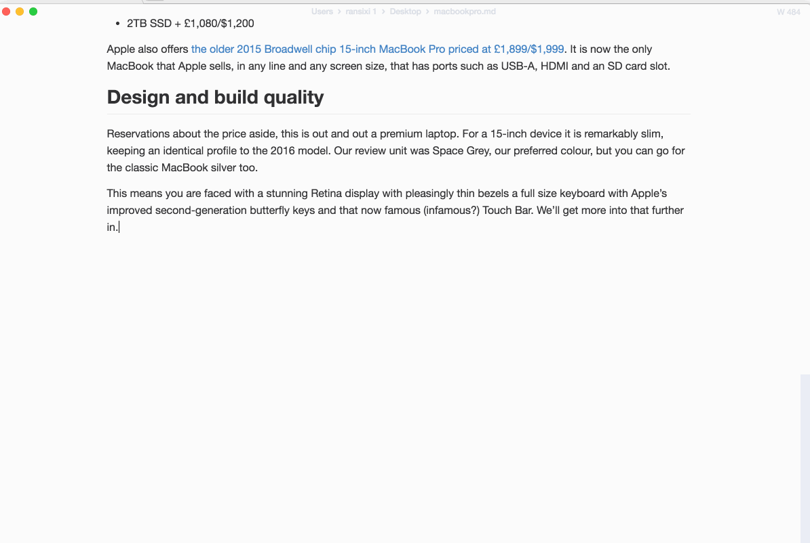

<p align="center"></p>

<h1 align="center">Mark</h1>

<div align="center">
  <strong>🔆 Modernized Markdown editor with Russian support 🌙</strong><br>
  A simple and elegant open-source Markdown editor focused on speed and usability.<br>
</div>

<div align="center">
  <a href="https://github.com/xronocode/mark/releases/latest">
    
  </a>
  <a href="https://github.com/xronocode/mark/releases">
    
  </a>
</div>

---

## Lineage

This project is a downstream fork in a chain of Markdown editor work:

1. **[marktext/marktext](https://github.com/marktext/marktext)** — original by [Jocs](https://github.com/Jocs) and [contributors](https://github.com/marktext/marktext/graphs/contributors). Unmaintained for ~3 years.
2. **[Tkaixiang/marktext](https://github.com/Tkaixiang/marktext)** — actively maintained modernization fork by [@tkaixiang](https://github.com/tkaixiang) which migrated the stack to electron-vite + Vue 3 + Pinia and bumped Electron to 41. **This is the upstream we track.**
3. **[xronocode/mark](https://github.com/xronocode/mark)** (this repo) — adds Russian localization, ad-hoc macOS signing for Apple Silicon, and Homebrew cask distribution. Roadmap also includes a Tauri v2 port for ~15 MB footprint.

All credit for the editor itself goes to Jocs, tkaixiang, and the marktext community. We rebase on tkaixiang's `main` branch and contribute fixes upstream where appropriate.

## Installing

> ℹ️ Early releases — please file bugs in the [issue tracker](https://github.com/xronocode/mark/issues). Per-version notes live in [CHANGELOG.md](CHANGELOG.md).

### macOS (Apple Silicon)

```bash
brew tap xronocode/mark
brew install --cask mark
```

The cask postflight clears the quarantine attribute automatically — no manual `xattr -cr` is needed. Builds are ad-hoc signed (`codesign --sign -`), not Apple-notarized.

### macOS (Intel)

Intel x86_64 is not in v1.0.0 (the macos-13 GitHub Actions runner failed to schedule during the release window). Coming in v1.0.1.

### Windows / Linux

Download from the [Releases page](https://github.com/xronocode/mark/releases). Best-effort builds; Linux supports `.AppImage`, `.deb`, `.rpm`, `.snap`, `.tar.gz`. For Arch Linux, the upstream [marktext-tkaixiang-bin](https://aur.archlinux.org/packages/marktext-tkaixiang-bin) AUR package by [@kromsam](https://github.com/kromsam) is also a viable choice.

## Screenshots


## Features

- 🆕 Now available in **10 languages** from the `Preferences` editor (Russian translation added by this fork; the other 9 by [@hubo1989](https://github.com/hubo1989) upstream):

  - `English` 🇺🇸
  - `Русский` 🇷🇺
  - `简体中文` 🇨🇳
  - `繁體中文` 🇹🇼
  - `Deutsch` 🇩🇪
  - `Español` 🇪🇸
  - `Français` 🇫🇷
  - `日本語` 🇯🇵
  - `한국어` 🇰🇷
  - `Português` 🇵🇹

- Realtime preview (WYSIWYG) with a clean, distraction-free interface.

- Supports [CommonMark](https://spec.commonmark.org/0.29/), [GitHub Flavored Markdown](https://github.github.com/gfm/) and selective [Pandoc Markdown](https://pandoc.org/MANUAL.html#pandocs-markdown).

- Markdown extensions: math expressions (KaTeX), front matter, emojis, footnotes, super/subscript.

- Diagram blocks: Mermaid (v11), Vega-Lite, PlantUML, flowcharts, sequence diagrams.

- Output to **HTML** and **PDF**.

- **33 built-in themes** including Dracula, Nord, Catppuccin, Tokyo Night, Gruvbox, and more.

- Editing modes: **Source Code**, **Typewriter**, **Focus**.

- Paste images directly from clipboard.

### Themes

**Light**: Ayu Light, Cadmium Light, Catppuccin Latte, Everforest Light, Graphite Light, Gruvbox Light, Rosé Pine Dawn, Solarized Light, Tokyo Night Light, Ulysses Light

**Dark**: Ayu Dark, Ayu Mirage, Cadmium Dark, Catppuccin Mocha, cyberdream, Dracula, Everforest Dark, Gruvbox Dark, Horizon Dark, Kanagawa, Material Dark, Monokai Pro, Nightfox, Nord, One Dark, Oxocarbon Dark, Palenight, Rosé Pine, Rosé Pine Moon, Solarized Dark, Synthwave '84, Tokyo Night, Tokyo Night Storm

| Cadmium Light                                     | Dark                                            |
| ------------------------------------------------- | ----------------------------------------------- |
|   |          |
| Graphite Light                                    | Material Dark                                   |
|  |  |
| Ulysses Light                                     | One Dark                                        |
|   |      |

> 📖 See [docs/THEMES.md](docs/THEMES.md) for the complete theme list.

### Edit Modes

| Source Code          | Typewriter               | Focus               |
|:--------------------:|:------------------------:|:-------------------:|
|  |  |  |

## Contributors

Original authors and upstream contributors:

<a href="https://github.com/marktext/marktext/graphs/contributors">
  
</a>

Modernization fork (electron-vite + Vue 3):

<a href="https://github.com/Tkaixiang/marktext/graphs/contributors">
  
</a>

This downstream fork (xronocode/mark): see [commit log](https://github.com/xronocode/mark/commits/main).

## Project Setup

See [Developer Documentation](docs/dev/README.md). Quick start:

```bash
# Clean install (skip native postinstall, then rebuild against Electron ABI)
npm install --ignore-scripts
node node_modules/electron/install.js
./node_modules/.bin/electron-rebuild

# Generate locale .min.json files
npm run minify-locales

# Production build
npm run build

# Run unpacked (preview mode — needs PERF_TESTING for locale lookup)
unset ELECTRON_RUN_AS_NODE
PERF_TESTING=true ./node_modules/.bin/electron .
```

## Releases

Per-version notes live in [CHANGELOG.md](CHANGELOG.md). Release artifacts (DMG, ZIP, AppImage, deb, rpm, snap, exe) are attached to the corresponding [GitHub Release](https://github.com/xronocode/mark/releases).

The release pipeline is `.github/workflows/release.yml`: pushing a tag `vX.Y.Z` triggers a draft Release with binaries for macOS arm64, Linux, and Windows. Maintainers manually publish the draft after CI completes.

### Maintainer cheatsheet

To ship a new version:
1. Land all changes on `main`.
2. Bump `version` in `package.json` and `package-lock.json`.
3. Add a new section to `CHANGELOG.md`.
4. Update the `Installing` section here if anything changed (e.g., new platform support, install caveat).
5. Tag: `git tag -a vX.Y.Z -m "..."` and `git push origin vX.Y.Z`.
6. Wait for CI; once green, click **Publish release** in the GitHub UI (or `gh release edit vX.Y.Z --draft=false`).
7. Refresh the cask in [xronocode/homebrew-mark](https://github.com/xronocode/homebrew-mark/blob/main/Casks/mark.rb): bump `version` and `sha256` (read sha256 from the GitHub asset API: `gh release view vX.Y.Z --json assets`).

## License

MIT — see [LICENSE](LICENSE). Original copyright Jocs 2017+, tkaixiang 2024+, xronocode 2026+.
