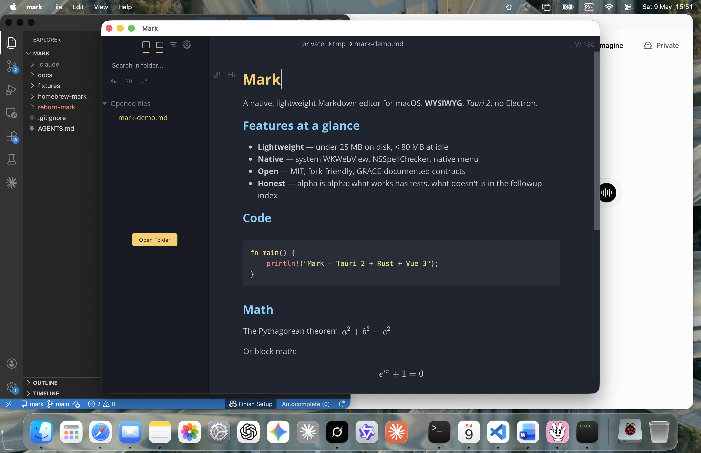
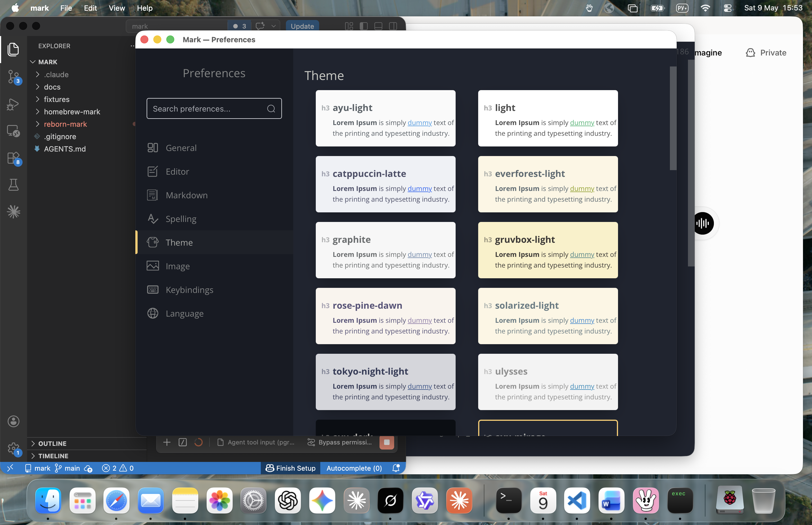

# Mark

[](https://github.com/xronocode/mark/actions/workflows/test.yml)


**A native, lightweight, security-first WYSIWYG Markdown editor for macOS, built on Tauri 2.**

<p align="left">
  <a href="https://ko-fi.com/xronocode" target="_blank" title="If Mark saves you a 200 MB Electron install — buy the maintainer a coffee">
    
  </a>
</p>



Mark is a from-scratch rewrite of [Mark Text](https://github.com/marktext/marktext) that ditches the 200 MB Electron shell and ships a 25 MB native binary instead. WKWebView for the UI, Rust for the backend, no Chromium runtime, no Node.js runtime. Boots in under a second, sandboxes filesystem access by design, and code-signs ad-hoc — no $99/year Apple Developer account required to ship to friends.

## Why Mark?

A markdown editor shouldn't weigh as much as Photoshop and shouldn't take six seconds to open a file. Mark exists because the WYSIWYG markdown experience of Mark Text was abandoned in 2023 and the community forks were stuck on the same heavy Electron base. So:

- **Lightweight**: ~25 MB on disk, ~80 MB at idle. Cold start under a second.
- **Native**: System WKWebView, native macOS menu, NSSpellChecker, ad-hoc Gatekeeper-friendly signing.
- **Open**: MIT, fork-friendly. Every module ships with a `MODULE_CONTRACT` documenting purpose, scope, and verification — refactor with confidence.
- **Honest**: Alpha is alpha. The [Status](#status) feature matrix is front-and-center, not buried. What works has tests; what doesn't is in the followup index with a target milestone.
- **Yours**: No telemetry, no cloud, no plugin marketplace pulling code from strangers. Files are files; the editor stays local.

Mark isn't trying to be the most feature-rich Markdown editor — it's trying to be the lightest one that still feels native on macOS.

### Themes

Light, dark, sepia, and 15+ named palettes (gruvbox, catppuccin, ayu, tokyo-night, solarized, rose-pine, …) ship in the box. Live cross-window broadcast keeps the Editor and Settings windows in sync.



> ⚠️ **This is an alpha.** Daily-driver-quality for routine writing on Apple Silicon (that's how it's developed), but it has known gaps. For a frozen-but-shipping Electron-engine alternative right now, install [`mark` (Phase A)](#electron-stable-channel) instead.

---

## How it works

```
┌──────────────────────────────────────────────────────┐
│  Vue 3 + Pinia + Element Plus + muya WYSIWYG engine  │   <-  src/renderer/
├──────────────────────────────────────────────────────┤
│  M-013a typed IPC contract (32 commands)             │
│  ipc.runtime: invoke / listen wrappers, type-checked │
├──────────────────────────────────────────────────────┤
│              Tauri 2 webview + IPC bridge            │
├──────────────────────────────────────────────────────┤
│  Rust backend (src-tauri/src/)                       │
│  ├─ m001  panic, save/close state machine, validate  │
│  ├─ m005  prefs (tauri-plugin-store + migration)     │
│  ├─ m006  global shortcuts                           │
│  ├─ m007  spellchecker (NSSpellChecker)              │
│  ├─ m008  font enumeration (font-kit)                │
│  ├─ m009  native menu                                │
│  ├─ m010  path sandbox + URL whitelist               │
│  ├─ m013b fs / search / watcher (notify-debouncer)   │
│  ├─ m015  pandoc bridge                              │
│  ├─ m016  auto-updater (ed25519)                     │
│  ├─ m017  recent docs                                │
│  ├─ m018  screenshot (macOS screencapture)           │
│  └─ m019  keychain (datacenter)                      │
└──────────────────────────────────────────────────────┘
```

The Vue frontend is ported from Mark Text v1.2.3; the muya engine has zero Electron coupling (verified — `grep -r 'require..electron' src/muya/` returns 0 hits). The IPC layer between Vue and Rust is fully typed: every renderer→backend call goes through `M-013a CommandMap` which is schema-validated against the `tauri::generate_handler!` list at boot. Drift between frontend and backend trips a startup dialog instead of a confusing runtime error.

Backend libraries doing the actual work: [`notify`](https://crates.io/crates/notify) + [`notify-debouncer-full`](https://crates.io/crates/notify-debouncer-full) for file-watching, [`grep-searcher`](https://crates.io/crates/grep-searcher) (in-process — no ripgrep shell-out) for folder search, [`font-kit`](https://crates.io/crates/font-kit) for system font enumeration, [`tauri-plugin-store`](https://crates.io/crates/tauri-plugin-store) for prefs persistence, [`tauri-plugin-updater`](https://crates.io/crates/tauri-plugin-updater) for ed25519-signed auto-update.

---

## Status

**v0.0.1-alpha** — usable for routine markdown writing on macOS Apple Silicon, not yet a drop-in replacement for the Electron build.

| Feature | Status |
|---|---|
| WYSIWYG markdown editing (muya engine) | ✅ |
| Save / Save As / Open file | ✅ |
| Multi-tab editing | ✅ |
| Open Folder / sidebar tree | ✅ |
| **External-edit live reload** (file-watcher) | ✅ |
| **Cross-window preference broadcast** (Settings ↔ Editor) | ✅ |
| Theme switching (light / dark / sepia + custom CSS) | ✅ |
| Native macOS menu + Cmd+Q | ✅ |
| Global shortcut (Cmd+Shift+M) | ✅ |
| **Dirty-tab close prompt** (Cmd+W on unsaved) | ✅ |
| Mermaid v11 / KaTeX / Vega diagrams | ✅ |
| Spell-check via NSSpellChecker | ✅ |
| Migration from Mark Text v1.2.x preferences | ✅ |
| Auto-update via Homebrew | ✅ |
| Find in file (Cmd+F) | ⚠ deferred to beta |
| Find in folder (ripgrep) | ⚠ deferred to beta |
| Print to PDF via Pandoc | ⚠ requires Pandoc on PATH |
| Linux / Windows builds | ❌ macOS-only at alpha |
| Plugin marketplace | ❌ out of scope |

Full followup index (currently 55 active items, bucketed alpha / beta / RC / post-1.0) lives in [`docs/development-plan.xml`](https://github.com/xronocode/mark/blob/main/docs/development-plan.xml).

---

## Install

### Tauri alpha (this branch)

```sh
brew tap xronocode/mark
brew install --cask mark@alpha
```

Ad-hoc signed. The cask postflight clears `com.apple.quarantine` so Gatekeeper accepts the local signature without prompting. No `sudo xattr` dance.

### Electron stable channel

If you want a battle-tested daily driver right now, install the Electron Phase A build instead:

```sh
brew tap xronocode/mark
brew install --cask mark
```

Both casks coexist (`Mark.app` + `Mark Alpha.app`). Run them side-by-side and migrate when the alpha hits feature parity.

When v2.0 stable ships, the `mark` cask rolls forward to the Tauri engine and `mark@v1` becomes a 12-month maintenance channel for users who can't migrate yet.

---

## Quality

This isn't a weekend port. The codebase has been polished in 8 phases of sign-off work:

| Surface | Coverage |
|---|---|
| Renderer unit tests | **310** tests, 8/10 stores at 100% line coverage |
| Backend unit tests | **392** tests, 80.88% workspace line coverage (85.22% excl. runtime-bound modules) |
| End-to-end (Playwright) | 5 specs against built renderer |
| CI matrix | macOS-14 + ubuntu-latest, on push & PR |
| Audit passes | grace-reviewer full-integrity, twice |

702 unit tests + 5 e2e + CI gate — see [`.github/workflows/test.yml`](https://github.com/xronocode/mark/blob/main/.github/workflows/test.yml).

---

## Build from source

Requirements:

- Rust **1.79+** (`rustup install stable`)
- Node **20 LTS**
- Xcode Command Line Tools (`xcode-select --install`) — for `safaridriver`, code-signing, and the Tauri webview shim

```sh
git clone https://github.com/xronocode/mark.git
cd mark
npm ci
npm run tauri build --debug      # → target/debug/bundle/macos/Mark.app
# or
npm run tauri build              # release: ~22 MB binary, LTO + strip
```

For a fast inner loop:

```sh
npm run tauri dev                # watches src/renderer + src-tauri
```

If `tauri dev` shows a blank window, see `src-tauri/tauri.dev.conf.json` — Vue 3 dev mode requires `'unsafe-eval'` in CSP for runtime template compilation, and that override is gated to dev only.

### Test

```sh
npm test                         # vitest (renderer)
cd src-tauri && cargo test --bin mark   # rust unit tests
npm run test:e2e                 # Playwright against built renderer
```

---

## Heritage

Mark stands on three repos worth of upstream:

1. **[marktext/marktext](https://github.com/marktext/marktext)** (2017–2023) — original Electron Mark Text by [@Jocs](https://github.com/Jocs). WYSIWYG markdown engine (muya), themes, the entire UX paradigm. Abandoned in 2023.
2. **[Tkaixiang/marktext](https://github.com/Tkaixiang/marktext)** (2023–) — community fork that picked up critical security and crash fixes (CVE-2023-2318, EPIPE crash, dark-mode flash, Mermaid v11 upgrade, full-WYSIWYG mode). The **Phase A Electron stable** in this repo is downstream of Tkaixiang.
3. **This repo (xronocode/mark)** — Phase A Electron 41 modernization (shipped as v1.2.3) + Phase B Tauri 2 rewrite (this branch).

The Phase A Electron build is feature-complete and frozen at v1.2.3 — it gets security fixes only. Phase B (Tauri) is where active development happens; when it reaches stable, the `mark` cask rolls forward.

| Branch | Engine | Status | Cask |
|---|---|---|---|
| `main` (this) | Tauri 2 + Rust + Vue 3 | **alpha** | `mark@alpha` |
| `electron` | Electron 41 + Vue 2 | stable, security-only | `mark` |
| `v1-on-tkaixiang` | upstream tracker | follows Tkaixiang | — |

---

## Contributing

Pull requests welcome. The project follows the **GRACE** (Graph-RAG Anchored Code Engineering) methodology — every module has a `MODULE_CONTRACT` header documenting its purpose, scope, dependencies, and verification reference. The `docs/` directory carries the development plan, knowledge graph, and verification matrix as XML artifacts that humans and agents both read.

Path of least friction:

1. Fork → branch from `main`.
2. Run `npm test && cd src-tauri && cargo test --bin mark` locally.
3. Open a PR — the GitHub Actions matrix gates merge on macOS + Linux.

For larger changes, please open an issue first; the codebase has a fairly opinionated layout (see [How it works](#how-it-works)).

---

## Support the project

Mark is built on personal time. If it saves you from a 200 MB Electron install or 6-second cold starts, consider buying me a coffee — it goes directly into more polish phases like the one this repo just went through.

<p align="left">
  <a href="https://ko-fi.com/xronocode" target="_blank">
    
  </a>
</p>

Other ways to help: ⭐ star the repo, file issues with concrete repros, or send a PR fixing something on the [followup list](https://github.com/xronocode/mark/blob/main/docs/development-plan.xml).

---

## License

[MIT](LICENSE), inherited from upstream Mark Text.

## Maintainer

[@xronocode](https://github.com/xronocode) · [Ko-fi](https://ko-fi.com/xronocode)
