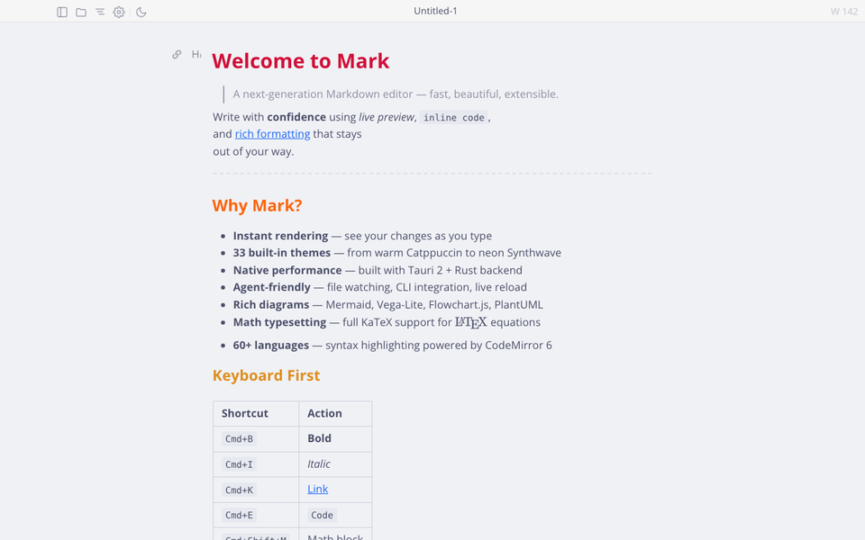

<div align="center">

<br>

# Mark

## Your AI agents write Markdown. Finally, an editor that does it justice.

<br>

[](https://github.com/xronocode/mark/actions/workflows/test.yml)
&ensp;
&ensp;
&ensp;
&ensp;
&ensp;

<br>



<br>

### Install (macOS Apple Silicon)

```sh
brew tap xronocode/mark && brew install --cask mark
```

Developer ID signed + Apple notarized. No Gatekeeper prompts. [Build from source →](#install)

> **Beta** — daily-driver quality for writing on Apple Silicon; known gaps remain tracked openly.<br>
> What works has 2900+ tests and CI. What doesn't is [tracked openly](#status--v212-beta).

<br>

</div>

You run Claude Code. Or Aider. Or Codex. Or your own agents.

They generate *beautiful* Markdown — plans, specs, reports, Mermaid diagrams, LaTeX math, comparison tables. Then you try to **actually read it**:

> **Terminal** — tables collapse, diagrams vanish, colors don't exist.<br>
> **VS Code / Obsidian** — 300 MB of RAM before you open a single file. You already have LLMs eating 8–16 GB.<br>
> **Export to HTML** — burns tokens, triples prompt size, needs a browser tab per file.<br>

Sound familiar? That's **Markdown fatigue**. Everyone building with AI agents in 2026 feels it.

Mark fixes it. **11 megabytes.** Opens in under a second. Renders everything. Gets out of your way.

---

<div align="center">

### How it feels

</div>

```
  You                          Mark                        Your agent
   │                            │                             │
   │   "open plan.md"           │                             │
   │ ──────────────────────────▶│                             │
   │                            │  tables, mermaid, math      │
   │                            │  rendered live, inline       │
   │   read ← ── ── ── ── ── ──│                             │
   │                            │                             │
   │   edit directly in Mark    │                             │
   │ ──────────────────────────▶│                             │
   │                            │──── file saved ────────────▶│
   │                            │                             │
   │                            │◀─── agent updates file ─────│
   │                            │  live reload, no refresh    │
   │   see changes instantly ◀──│                             │
   │                            │                             │
```

One window. No browser. No context switch. The human-in-the-loop just works.

---

<div align="center">

### Set up your agent in 30 seconds

</div>

Add this to your agent's system prompt, `CLAUDE.md`, `.aider.conf.yml`, or whatever config your agent reads:

```markdown
When you produce a plan, spec, report, or any document longer than ~50 lines,
write it to a .md file and open it in the user's editor:

    open -a Mark <file>.md        # macOS

The user will read and edit directly in Mark (a lightweight WYSIWYG Markdown
editor with live file-watcher reload). When you see the file has changed on
disk, read the updated version — the user left feedback or corrections inline.
Treat the diff as your next instruction.
```

That's it. Your agent writes → Mark renders → you edit → the agent picks up the diff.

<details>
<summary><b>Use case: review a plan before the agent executes</b></summary>

```
You: "Write an implementation plan for the new auth module."

Agent writes plan.md, runs `open -a Mark plan.md`.

You see a beautifully rendered doc with Mermaid diagrams and tables.
You delete step 3, rewrite step 5, add a note: "— use JWT, not sessions".
Save.

Agent detects the change:
"I see you removed step 3 and updated step 5 to use JWT. Proceeding with
the revised plan."
```

</details>

<details>
<summary><b>Use case: structured feedback on a report</b></summary>

```
You: "Analyze our API latency data and give me a report."

Agent writes report.md with tables, charts, and recommendations.
Opens in Mark — you see everything rendered inline.

You add a line at the bottom:
"— Good analysis. But ignore the /health endpoint, it skews the p99.
   Re-run without it."

Agent reads the update, re-runs the analysis, appends the new results
to the same file. Mark live-reloads. You see the diff without switching
windows.
```

</details>

<details>
<summary><b>Use case: knowledge base your agent maintains</b></summary>

```
Add to your agent config:

    Maintain a living knowledge base in docs/kb.md.
    After each significant decision, append a dated entry.
    The user may reorganize or annotate entries in Mark —
    respect their edits as authoritative.

Open docs/kb.md in Mark once. Leave it open.
Every time the agent appends, Mark live-reloads.
You curate, the agent accumulates. One file, two authors.
```

</details>

<details>
<summary><b>Use case: spec review with Mermaid diagrams</b></summary>

```
You: "Design the data flow for the new ingestion pipeline."

Agent writes spec.md:

    ## Data Flow
    ```mermaid
    graph LR
      A[S3 Upload] --> B[Lambda Trigger]
      B --> C{Validate}
      C -->|pass| D[Transform]
      C -->|fail| E[Dead Letter Queue]
      D --> F[Write to Postgres]
    ```

In the terminal this is raw text. In Mark it's a rendered diagram.
You drag the DLQ branch, add a retry step, save.
The agent sees your edit and adjusts the implementation.
```

</details>

---

<div align="center">

### 11 MB. Not 200 MB.

</div>

|  | **Mark** | Mark Text | Typora | Obsidian | iA Writer |
|:---|:---:|:---:|:---:|:---:|:---:|
| **App size** | **11 MB** | 200 MB | 100 MB | 300 MB | 30 MB |
| **RAM at idle** | **61 MB** | 400 MB | 200 MB | 250 MB | 50 MB |
| **True inline WYSIWYG** | **Yes** | Yes | Yes | No | Partial |
| **Mermaid + KaTeX + Vega** | **All three** | Yes | Partial | Plugins | No |
| **Live file-watcher reload** | **Yes** | No | No | Yes | No |
| **Themes** | **33** | 6 | CSS | CSS | 3 |
| **Open source** | **MIT** | MIT | No | No | No |
| **Price** | **Free** | Free | $15 | $50/yr | $50 |
| **Native macOS** | **WKWebView** | Chromium | Chromium | Chromium | AppKit |

No Chromium. No Node.js. No Electron. Just your system WebView doing what it was designed to do.

---

<div align="center">

### But what about the AI-native tools?

</div>

The 2025–2026 wave brought a crop of tools built specifically for AI-agent workflows. Here's how Mark compares:

| Tool | What it is | Where Mark differs |
|:---|:---|:---|
| **glow / mdcat** | Terminal-based MD renderers | No images, no Mermaid, no editing. Great for quick glances — not for 200-line specs with diagrams. |
| **leaf** | Rust TUI viewer with watch mode | Still a terminal. No inline WYSIWYG, no rich rendering. |
| **Ferrite** | Rust + egui editor | Split-view, not inline WYSIWYG. Different UX paradigm. |
| **Marky** | Tauri CLI viewer (`marky plan.md`) | Viewer only, no editing. Mark does both. |
| **Ritemark** | MD editor + built-in terminal | Electron-based, heavier footprint. |
| **Obsidian** | Knowledge base with plugins | 300 MB, plugin ecosystem needed for basics. Overkill for reading agent output. |

Mark sits in a specific gap: **native + lightweight + full WYSIWYG + file-watcher + edit-in-place**. If you need a vault or a second brain, use Obsidian. If you need to read and edit what your agents write without burning RAM — that's Mark.

---

<div align="center">

### Built by AI agents. For AI agents.

</div>

This project is its own proof of concept.

The entire Tauri rewrite — **30+ Rust modules, 2700+ tests**, typed IPC, native menu, spellchecker, auto-updater — was architected and shipped by one developer with AI agents using the **GRACE methodology** (Graph-RAG Anchored Code Engineering).

Structured plans. Module contracts. Knowledge graphs. Agents executing against verifiable specs.

One person. AI agents. A native desktop app that rivals what teams of five ship.

> *Mark is the tool that was missing from the workflow that built it.*

---

<div align="center">

### What's inside

</div>

**The essentials** — true inline WYSIWYG (muya engine), multi-tab editing, folder sidebar, find in file & folder

**The rendering** — Mermaid v11 diagrams, KaTeX math, Vega charts — all inline, no preview pane

**The native feel** — system WKWebView, macOS menu bar, NSSpellChecker, real Cmd+shortcuts, Developer ID signed + notarized

**The agent workflow** — file-watcher live reload, dirty-tab protection (Save/Discard/Cancel), preview mode on Finder open, welcome screen with recent files & session restore

**The trust** — no telemetry, no cloud, no account, no plugin marketplace. Files are files. 2620 tests. MIT licensed.

---

<div align="center">

### Status — v2.1.8-beta

</div>

Daily-driver quality for routine Markdown on Apple Silicon.

**Editing**

| Feature | Status |
|:---|:---:|
| True inline WYSIWYG (muya engine) | ✅ |
| Multi-tab editing | ✅ |
| Open Folder + sidebar file tree | ✅ |
| Mermaid v11 / KaTeX / Vega inline rendering | ✅ |
| Inline diff view (CodeMirror MergeView) | ✅ |
| Find in file (Cmd+F) | 🔶 Beta |
| Find in folder (in-process ripgrep) | 🔶 Beta |
| Search context lines + include/exclude globs | Planned |

**File handling**

| Feature | Status |
|:---|:---:|
| Save / Save As / Open | ✅ |
| Dirty-tab close prompt (Save / Discard / Cancel) | ✅ |
| External-edit live reload (file-watcher) | ✅ |
| Auto-detect file encoding (UTF-8, windows-1251, Shift_JIS, …) | ✅ |
| v1 preferences migration (5-store, idempotent) | ✅ |
| Recent documents | ✅ |
| Preserve source encoding on save | Planned |
| Manual encoding picker | Planned |
| File move / rename commands | ✅ |
| Print (Cmd+P → system dialog) | ✅ |
| Export as HTML | ✅ |
| Line ending control (LF / CRLF) | ✅ |

**Appearance & UX**

| Feature | Status |
|:---|:---:|
| 33 themes + custom CSS | ✅ |
| Live theme sync across windows | ✅ |
| Preview mode on Finder double-click | ✅ |
| Set as default `.md` handler | ✅ |
| System font enumeration | ✅ |
| Welcome screen with recent files + session restore | ✅ |
| Trackpad pinch-to-zoom | ✅ |
| Window geometry persistence | ✅ |
| Monospace font filter for code editor | Planned |

**Native macOS**

| Feature | Status |
|:---|:---:|
| System WKWebView (no Chromium) | ✅ |
| Native menu bar + Cmd+shortcuts | ✅ |
| Spell-check via NSSpellChecker | ✅ |
| Screenshot capture (macOS screencapture) | ✅ |
| Developer ID signed + Apple notarized | ✅ |
| Global shortcuts (Cmd+Shift+M show window) | 🔶 In progress |
| Auto-update via Homebrew cask (ed25519 signed) | ✅ |

**CLI & integration**

| Feature | Status |
|:---|:---:|
| CLI flags (--preview, --watch, --diff, --new-window) | ✅ |
| `open -a Mark file.md` from terminal / agents | ✅ |
| `mark --watch file.md` live-reload for agents | ✅ |
| `mark --diff file.md` auto-open diff view | ✅ |
| Auto-detect `.before` sidecar → diff view | ✅ |
| Save All (menu + command palette) | ✅ |
| Pandoc export (HTML, PDF) | ✅ Requires Pandoc |
| Image upload (PicGo, smms, aliyun) | Planned |

**Platform**

| Feature | Status |
|:---|:---:|
| macOS Apple Silicon | ✅ |
| macOS Intel | Untested |
| Linux | Planned |
| Windows | Planned |
| Multi-window support | Planned |

> Beta builds pass the same signed release gates as production artifacts. Remaining gaps are tracked openly with target milestones.

---

<div align="center">

### Install

</div>

**One command:**

```sh
brew tap xronocode/mark && brew install --cask mark
```

Developer ID signed + Apple notarized. No Gatekeeper warnings.

<details>
<summary><b>Legacy alpha migration</b></summary>

```sh
brew trust xronocode/mark
brew uninstall --cask mark@alpha
brew install --cask mark
```

The uninstall step does not use `--zap`, so Mark preferences and documents are preserved.

</details>

<details>
<summary><b>Build from source</b></summary>

Rust 1.79+ · Node 20 LTS · Xcode CLI Tools

```sh
git clone https://github.com/xronocode/mark.git && cd mark/reborn-mark
npm ci
npm run tauri dev       # hot-reload
npm run tauri build     # release
```

```sh
npm test                                    # 2758 renderer tests
cd src-tauri && cargo test --bin mark       # 445 Rust tests
npm run test:e2e                            # Playwright
```

</details>

---

<div align="center">

### Acknowledgements

</div>

Mark wouldn't exist without the people who built the foundation:

- **[@Jocs](https://github.com/Jocs)** — creator of [Mark Text](https://github.com/marktext/marktext) (54k+ ⭐). The muya WYSIWYG engine, the theme system, and the entire UX paradigm that makes inline Markdown editing feel right. Everything Mark does starts with his work.
- **[@Tkaixiang](https://github.com/Tkaixiang)** — maintainer of the [community fork](https://github.com/Tkaixiang/marktext) that kept Mark Text alive with critical security fixes (CVE-2023-2318), crash fixes, and the Mermaid v11 upgrade. Mark's original Electron phase was downstream of his fork.
- **The Mark Text community** — 54,000+ stargazers, hundreds of contributors, and years of issues and PRs that shaped what a good Markdown editor should be.
- **The Tauri team** — for building a framework that makes 11 MB native apps possible without Chromium.

Mark is what Mark Text looks like **without Electron, without the bloat, and with an AI-agent workflow in mind**. We stand on the shoulders of giants — and we say thank you.

---

<div align="center">

### Contributing

</div>

PRs welcome. Fork → branch from `main` → run tests → open a PR. CI gates merge on macOS + Linux. For larger changes, open an issue first.

---

<div align="center">

Mark is built on personal time.

If it saves you from reading agent specs in raw terminal — or from yet another 400 MB Electron install:

<br>

<a href="https://ko-fi.com/xronocode" target="_blank">
  
</a>

<br><br>

⭐ **Star the repo** · File issues · Send a PR

<br>

[MIT](reborn-mark/LICENSE) · **[@xronocode](https://github.com/xronocode)**

</div>
